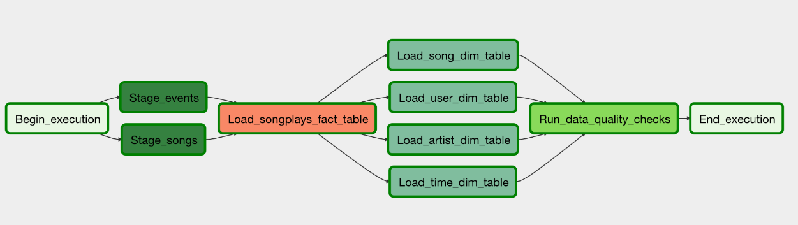

# Data-Pipelines-With-Airflow
## Description

Working on a music streaming company's data infrastructure by creating anf automating a set of data pipelines with Airflow, monitoring and debugging production pipelines

## Datasets

For this project, there are two datasets. Here are the s3 links for each:

>**s3://udacity-dend/song-data/** 
>**s3://udacity-dend/log-data/**

## Copy S3 Data

Copy the data from the udacity bucket to the home cloudshell directory:

>**aws s3 cp s3://udacity-dend/log-data/ ~/log-data/ --recursive/** 
>**aws s3 cp s3://udacity-dend/song-data/ ~/song-data/ --recursive/**

Copy the data from the home cloudshell directory to your own bucket -- this is only an example:

aws s3 cp ~/log-data/ s3://thuantn5-datalake/log-data/ --recursive
aws s3 cp ~/song-data/ s3://thuantn5-datalake/song-data/ --recursive

## Configuring the DAG

In the DAG, add default parameters according to these guidelines

1. The DAG does not have dependencies on past runs
2. On failure, the task are retried 3 times
3. Retries happen every 5 minutes
4. Catchup is turned off
5. Do not email on retry

In addition, configure the task dependencies so that after the dependencies are set, the graph view follows the flow shown in the image below.

## Building the operators

### Stage Operator

The stage operator is expected to be able to load any JSON formatted files from S3 to Amazon Redshift. The operator creates and runs a SQL COPY statement based on the parameters provided. The operator's parameters should specify where in S3 the file is loaded and what is the target table.

The parameters should be used to distinguish between JSON file. Another important requirement of the stage operator is containing a templated field that allows it to load timestamped files from S3 based on the execution time and run backfills.

### Fact and Dimension Operators

With dimension and fact operators, you can utilize the provided SQL helper class to run data transformations. Most of the logic is within the SQL transformations and the operator is expected to take as input a SQL statement and target database on which to run the query against. You can also define a target table that will contain the results of the transformation.

Dimension loads are often done with the truncate-insert pattern where the target table is emptied before the load. Thus, you could also have a parameter that allows switching between insert modes when loading dimensions. Fact tables are usually so massive that they should only allow append type functionality.

### Data Quality Operator

The final operator to create is the data quality operator, which is used to run checks on the data itself. The operator's main functionality is to receive one or more SQL based test cases along with the expected results and execute the tests. For each the test, the test result and expected result needs to be checked and if there is no match, the operator should raise an exception and the task should retry and fail eventually.

